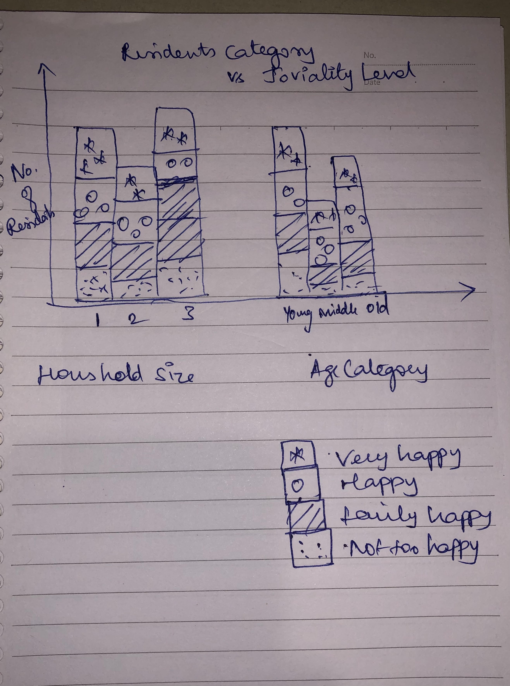
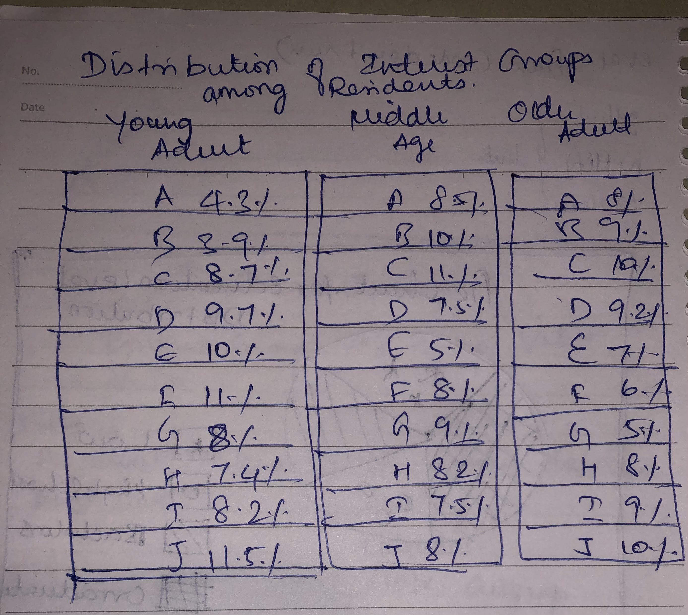
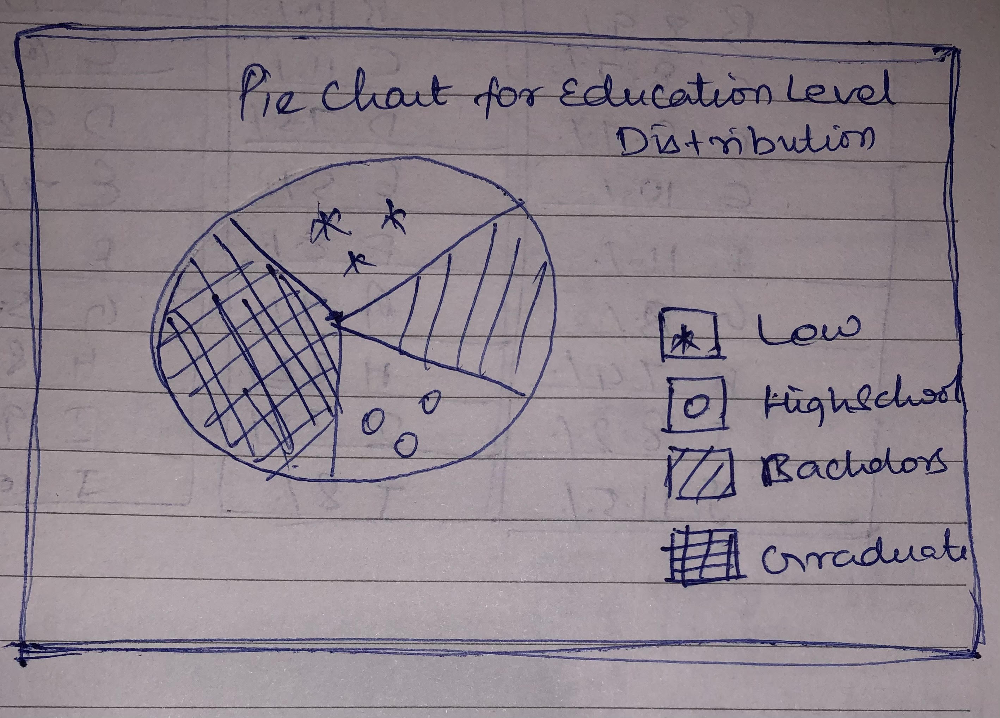

```{r setup, include=FALSE}
knitr::opts_chunk$set(echo = TRUE)
```

# 1.Overview

In this Take-home Exercise 1, I have explored demographic of the [city of Engagement, Ohio USA](https://vast-challenge.github.io/2022/) by using appropriate statistical graphic methods in R. The data is processed by using [**tidyverse**](https://www.tidyverse.org/packages/) family of packages and the statistical graphics are prepared by using [**ggplot2**](https://ggplot2.tidyverse.org/) and its extensions.

# 2.Task
Lets breakdown the demographic analysis into individual components and try to answer the following questions  
1. Which category residents are more jovial?  
2. Are the residents with specific educational qualification shares similar interest group ?  
3. What's the most common educational qualification among the residents?  

# 3.Getting Started
### 3.1 Data
The dataset used in this exercise is *Participants.csv* file which contains information about the residents such as age, educationlevel, household size etc.,
Link to download the dataset is found below

[Download Participants.csv](data/Participants.csv)

### 3.2 Installing and loading the required libraries
Before we get started, it is important for us to ensure that the required R packages have been installed. If yes, we will load the R pacakges. If they have yet to be installed, we will install the R packages and load them onto R environment.The required packages are **tidyverse, ggplot2, dplyr, likert, plotrix, plyr, patchwork, ggthemes**

The code chunk below is used to install and load the required packages onto RStudio.

```{r}
packages = c('tidyverse','ggplot2','dplyr','plotrix','plyr','patchwork','ggthemes')
for(p in packages){
  if(!require(p, character.only = T)){
    install.packages(p)
  }
  library(p, character.only = T)
}

```

### 3.3 Importing Data

The code chunk below imports *Participants.csv* from the data folder into R by using [`read_csv()`](https://readr.tidyverse.org/reference/read_delim.html) of [**readr**](https://readr.tidyverse.org/index.html) and save it as an tibble data frame called *part_data*

```{r}
# read csv file
data <- read.csv("data/Participants.csv")
head(data)
```

### 4. Which category residents are more jovial?

### 4.1 Sketch of Proposed Design

The below figure shows the proposed sketch

 {width=250px}

### 4.2 Data Wrangling

### Recoding Joviality group

The values ranging from [0,1] indicating the participant’s overall
happiness level at the start of the study are recoded into 4 levels such as **'Not too Happy',  'Fairly Happy', 'Happy','Very Happy'** using the below code chunk. It can be performed using [`cut()`](https://www.rdocumentation.org/packages/base/versions/3.6.2/topics/cut) which helps to convert the numeric values to factors.

```{r}
data$jovialityGroup <- cut(data$joviality, breaks =c(-Inf,0.2,0.5,0.8,1),labels=c("Not too Happy","Fairly Happy","Happy","Very Happy"))
table(data$jovialityGroup)
```

### Recoding age group

Similar to `jovialityGroup` age groups are also created such as **'Young Adult',  'Middle Age', 'Older Adult'** using `cut()`  

```{r}
data$ageGroup <- cut(data$age,breaks=c(18,35,55,Inf),labels=c("Young Adult","Middle Age","Older Adult"),
include.lowest = TRUE)
table(data$ageGroup)
```

### 4.3 Creating Basic Chart
To answer the question of which category residents are more jovial, lets create 3 individual charts for joviality across Household size, No. of kids, Age category and then draw a final conclusion.

```{r, fig.width=11, fig.height=7}

g1 <- ggplot(data,aes(householdSize, fill = jovialityGroup))+
  geom_bar()+
  theme(legend.position = "none")+
  xlab("Household Size") + ylab("No. of \n residents") +
  theme(axis.title.y=element_text(angle=0,vjust = 0.5),
        axis.text = element_text(face="bold"))
g2 <- ggplot(data,aes(haveKids, fill = jovialityGroup))+
  geom_bar() +
  theme(legend.position = "none")+
  theme(axis.title.y  = element_blank(),
        axis.text = element_text(face="bold"))+
  xlab("Having Kids") + ylab("No. of residents")
g3 <- ggplot(data, aes(ageGroup, fill= jovialityGroup))+
  geom_bar() +
  theme(axis.title.y  = element_blank(),
        axis.text = element_text(face="bold"))+
  xlab("Age Category") + ylab("No. of residents")
g1+g2+g3
```
### 4.4 Formatting
### Changing the order of x labels of Having Kids bar plot

Order of x labels in the chart can be rearranged using [`factor()`](https://www.rdocumentation.org/packages/base/versions/3.6.2/topics/factor) 

```{r}
lvl_kids <- factor(data$haveKids, level = c('TRUE', 'FALSE'))
```

### Changing the order of stacking and legend

In ggplot2, the legend order is determined by the stack order. So, reversing the order of factor levels can be done using [`fct_rev()`](https://forcats.tidyverse.org/reference/fct_rev.html)

```{r}
g1<-ggplot(data,aes(householdSize, fill = forcats::fct_rev(jovialityGroup)))
g2<-ggplot(data,aes(lvl_kids, fill = forcats::fct_rev(jovialityGroup))) 
g3<-ggplot(data, aes(ageGroup, fill=forcats::fct_rev(jovialityGroup)))
```

### Annotate the final patchwork 

Three individual charts are combined using `patchwork()`[https://cran.r-project.org/web/packages/patchwork/vignettes/patchwork.html]
Also, Main title for the chart is created using [`plot_annotation`](https://www.rdocumentation.org/packages/patchwork/versions/1.1.1/topics/plot_annotation) along with orientation adjustment using [`theme()`](https://ggplot2.tidyverse.org/reference/theme.html)
The below code chunk accomplishes all the above mentioned formatting 

```{r}
patchwork <- g1 + g2 + g3 +
  plot_annotation(title = "Residents of young age and those who are not having kids are much happier comparatively") & 
  theme(plot.title = element_text(hjust = 0.5))
```

### 4.5 Final Chart

Final chart with necessary formatting is created using below code chunk

```{r, fig.width=11,fig.height=7}
g1 <- ggplot(data,aes(householdSize, fill = forcats::fct_rev(jovialityGroup)))+
  geom_bar()+
  theme(legend.position = "none")+
  xlab("Household Size") + ylab("No. of residents") +
  theme(axis.title.y=element_text(angle=0,vjust = 0.5),
        axis.text = element_text(face="bold"))
g2 <- ggplot(data,aes(lvl_kids, fill = forcats::fct_rev(jovialityGroup)))+
  geom_bar() +
  theme(legend.position = "none")+
  theme(axis.title.y  = element_blank(),
        axis.text = element_text(face="bold"))+
  xlab("Having Kids") + ylab("No. of residents")
g3 <- ggplot(data, aes(ageGroup, fill=forcats::fct_rev(jovialityGroup)))+
  geom_bar() +
  theme(axis.title.y  = element_blank(),
        axis.text = element_text(face="bold"))+
  xlab("Age Category") + ylab("No. of \n residents")+
  labs(fill = "Happiness Level")
g1 + g2 + g3 +
  plot_annotation(title = "Residents of young age and those who are not having kids are much happier comparatively") & 
  theme(plot.title = element_text(hjust = 0.5),
        axis.text = element_text(face="bold"))

```
### 4.5 Insights from the Visualisation

The chart shows that many residents who are young and without kids are much happier than the residents who are old adult and having kids. 


### 5. Is there a specific interest group which attracts young adults or Older adults?
### 5.1 Sketch of Proposed Design

The below figure shows the proposed sketch

 {width=250px}
 
### 5.2 Data Wrangling


### Compute proportion 

The proportion of interest group in each age category is computed using below code chunk.
[`group_by()`](https://www.rdocumentation.org/packages/dplyr/versions/0.7.8/topics/group_by). `group_by()` function is used to group the dataframe by multiple columns such as Age Group and Interest Group and [`count()`](https://dplyr.tidyverse.org/reference/count.html) function helps to count the unique values of variables.

```{r}
df <- data %>%
  group_by(ageGroup,interestGroup) %>%
  dplyr::summarise(count=n()) %>%
  mutate(ageGroup.count = sum(count),
         prop = count/sum(count)) %>%
  ungroup()
df

```

### 5.3 Creating Basic Chart

The basic ggplot chart is created using the below code chunk

```{r}
ggplot(df,
       aes(x = ageGroup, y = prop, width = ageGroup.count, fill = interestGroup)) +
  geom_bar(stat = "identity", position = "fill", colour = "black") +
  facet_grid(~ageGroup, scales = "free_x", space = "free_x") +
  scale_fill_brewer(palette = "Set3") +
  theme(panel.spacing.x = unit(0, "npc")) +
  theme_void()

```
### 5.4 Formatting

### Adding percentage values

The proportion value calculated previously is shown on the bars for comparison purposes. The [`geom_text`()](https://ggplot2.tidyverse.org/reference/geom_text.html) is used for labelling plots. Also, [`scales::percent`](https://scales.r-lib.org/reference/label_percent.html) is used to display the value in percentage with value rounded to 1 decimal point.

It is accomplished by below code chunk

```{r, warning=FALSE}
geom_text(aes(label = scales::percent(prop, accuracy = 0.1L)), position = position_stack(vjust = 0.5))
```
### Adding appropriate plot and legend title

Main title for chart is added using [`ggtitle()`](https://ggplot2.tidyverse.org/reference/labs.html) and legend title is added using [`labs()`](https://www.rdocumentation.org/packages/ggplot2/versions/2.1.0/topics/labs)

```{r,warning=FALSE, message=FALSE}
geom_text(aes(label = scales::percent(prop, accuracy = 0.1L)), position = position_stack(vjust = 0.5))
```

### 5.5 Final Chart

Final chart with necessary formatting is created using below code chunk

```{r}
ggplot(df,
       aes(ageGroup, y = prop, width = ageGroup.count, fill = interestGroup)) +
  geom_bar(stat = "identity", position = "fill", colour = "black") +
  
  #geom_text(aes(label = scales::percent(prop, accuracy = 0.1L)),hjust=0.5 ,position = position_stack(vjust = 0.5 ))+
  
  facet_grid(~ageGroup, scales = "free_x", space = "free_x") +
  scale_fill_brewer(palette = "Set3") +
  theme(panel.spacing.x = unit(0, "npc")) + # if no spacing preferred between bars
  theme_void()+
  labs(fill="Interest Group")+
  xlab("Age Category")+
  ggtitle("Interest Group F is least preferred by Young Adults and most preferred by Older Adults")+
  theme(plot.title = element_text(hjust = 0.5))
```

### 5.5 Insights from the Visualisation

Interest Group F is quite common among Older adults and it is the least preferred group among young adults


### 6.What's the most common educational qualification among the residents?
### 6.1 Sketch of Proposed Design
The below figure shows the proposed sketch

 

### 6.2 Data Wrangling

### Computing frequency by education level

The no. of residents with specific Educatio level is computed using below code chunk.
[`group_by()`](https://www.rdocumentation.org/packages/dplyr/versions/0.7.8/topics/group_by). `group_by()` function is used to group the dataframe by education level and
[`count()`](https://dplyr.tidyverse.org/reference/count.html) function helps to count the unique values of variables

```{r}
ed_level_data <- data %>%
  group_by(educationLevel) %>%
  dplyr::summarise(count = n())
ed_level_data
```

### Computing cumulative sum

Cumulative sum is calculated using [`cumsum`](https://www.rdocumentation.org/packages/base/versions/3.6.2/topics/cumsum) function to determine the proportion of residents with each education level

```{r}
ed_level_data <- ed_level_data %>% 
  arrange(desc(educationLevel)) %>%
  mutate(prop = count / sum(ed_level_data$count) *100) %>%
  mutate(ypos = cumsum(prop)- 0.5*prop )
ed_level_data
```
### 6.3 Creating Basic Chart

A pie chart in ggplot is a bar plot plus a polar coordinate. Hence, [`coord_polar()`](https://ggplot2.tidyverse.org/reference/coord_polar.html) is used to create a circular chart . The basic ggplot chart is created using the below code chunk

```{r}
ggplot(ed_level_data, aes(x="", y=prop, fill=educationLevel)) +
  geom_bar(stat="identity", width=1, color="white") +
  coord_polar("y", start=0) +
  theme_void() 
```

### 6.4 Formatting

### Changing legend order

The legend order is quite inappropriate. It can be rearranged using 
[`factor()`](https://www.rdocumentation.org/packages/base/versions/3.6.2/topics/factor)

```{r}
edu_order <- factor(ed_level_data$educationLevel, level = c('Low', 'HighSchoolOrCollege','Bachelors','Graduate'))
```

### Improving the aesthetics of the chart

Main title for chart is added using [`ggtitle()`](https://ggplot2.tidyverse.org/reference/labs.html) and legend title is added using [`labs()`](https://www.rdocumentation.org/packages/ggplot2/versions/2.1.0/topics/labs).
Also, since this pie chart is built on bar chart, conventional axis labels and tick elements should be made invisible. It can be performed using [`theme`](https://ggplot2.tidyverse.org/reference/theme.html)

And final chart is obtained using the below code chunk

```{r}
ggplot(ed_level_data, aes(x = "", y = prop, fill = edu_order)) +
  geom_col(color = "black") +
  geom_text(aes(label = scales::percent(prop/100)),
            position = position_stack(vjust = 0.5)) +
  coord_polar(theta = "y") +
  geom_label(aes(label = scales::percent(prop/100)),
             position = position_stack(vjust = 0.5),
             show.legend = FALSE)+
  ggtitle("Majority of the residents are High School or College Graduate")+
  labs(fill = "Education Level")+
  scale_fill_manual(values=c("#FF5733", "#75FF33", "#33DBFF", "#BD33FF"))+
  scale_fill_discrete(limits = c("Graduate", "Bachelors", "HighSchoolOrCollege","Low"))+
  theme(axis.text = element_blank(),
        axis.ticks = element_blank(),
        axis.title = element_blank(),
        panel.grid = element_blank(),
        panel.background = element_rect(fill = "#ebf2ff"),
        plot.background = element_rect(fill = "#ebf2ff"),
        plot.title=element_text(hjust = 0.01,vjust=0.9),
        legend.background = element_rect(fill = "#ebf2ff")) 

```

### 6.5 Insights from the Visualisation

The chart shows that education level of majority of the residents are upto High school o College.

