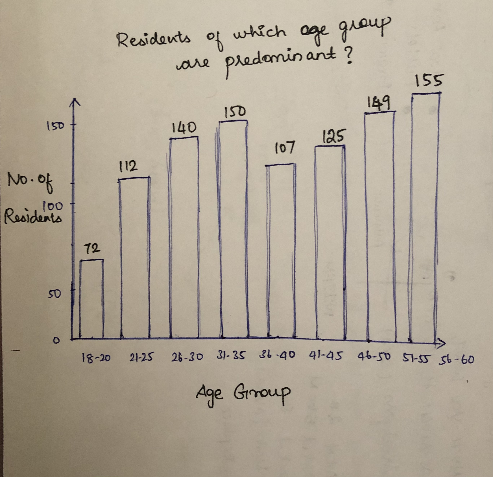
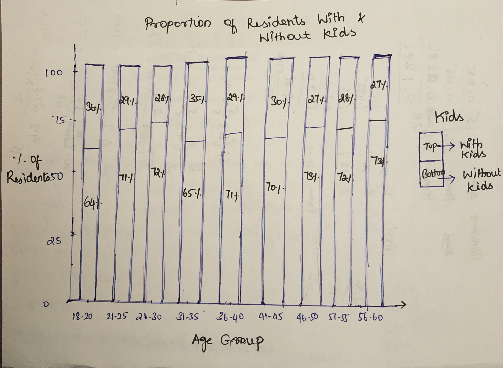
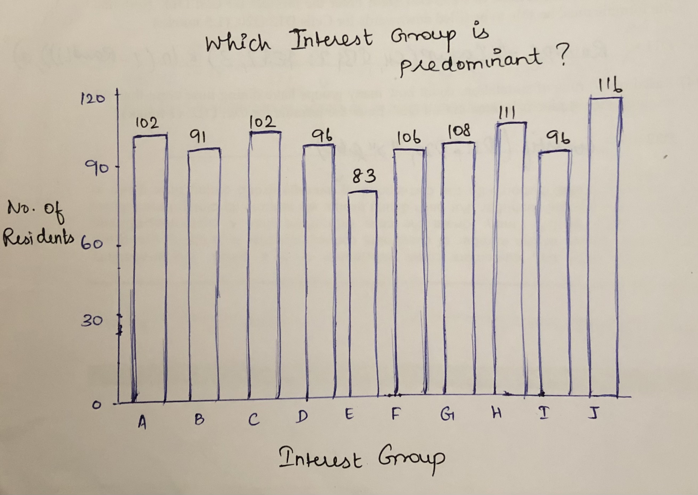

```{r setup, include=FALSE}
knitr::opts_chunk$set(echo = TRUE)
```

## 1. Overview

In this Take-home Exercise 2, I have chosed one of my classmate's Take-home Exercise 1 submission and analysed the charts in terms of **clarity and aesthetics**. Also, remaked the original design by using data visualisation principles and best practises learnt in previous two classes.

## 2. Getting Started
### Installing and loading necessary packages
Before we get started, it is important for us to ensure that the required R packages have been installed. If yes, we will load the R pacakges. If they have yet to be installed, we will install the R packages and load them onto R environment.The required packages are **tidyverse, ggplot2, dplyr and patchwork.**

The code chunk below is used to install and load the required packages onto RStudio.

```{r}
packages = c('tidyverse','ggplot2','dplyr','patchwork')
for(p in packages){
  if(!require(p, character.only = T)){
    install.packages(p)
  }
  library(p, character.only = T)
}

```

### Importing data
The code chunk below imports *Participants.csv* from the data folder into R by using [`read_csv()`](https://readr.tidyverse.org/reference/read_delim.html) of [**readr**](https://readr.tidyverse.org/index.html) and save it as an tibble data frame called *data*

```{r}
# read csv file
data <- read.csv("data/Participants.csv")
head(data)
```

## 3. Critique 1  
### 3.1 Original Design
The original design is shown below


Usage of Bar chart is ideal as it serves the purpose of displaying the count of residents in each age category. Yet, this chart can be improved in terms of following criteria

### 3.2 Clarity

### *(a) Graph Title*
Interesting insight from the graph can be put as a main title for chart instead of conventional graph name as the former creates curiosity among the users to deep dive in it.

### *(b) Axes Labeling*
New axes labels can be provided for graphs rather than using same as its column names as sometimes column names such as **cnt** will not be meaningful for users while reading charts.

### *(c) Axes tick marks*
Tick marks can be superfluous on categorical scale. Here age groups are grouped into a bin and so tick marks on the x-axis are not required.

### 3.3 Aesthetics
### *(a) Alignment - Graph Title*
Main title at the center will be more appealing than at the left.

### *(b) Rotation of x-axis tick mark labels*
It would be easier for users to read an interpret the graph if its axes labels are written horizontally instead of vertical direction. Atleast, it can be tilted slightly due to space constraints.

### *(c) Gridlines - Not necessary*
Since the data labels are already mentioned at the top of bars, here the grid lines are redundant.


### 3.4 Sketch of Proposed Design

Rough sketch of proposed design is shown below



### 3.5 Data Wrangling
### Categorising age groups

The values ranging from [0,1] indicating the participant’s overall
happiness level at the start of the study are recoded into multiple levels such as **'18-20','21-25','26-30','31-35','36-40','41-45','46-50','51-55','56-60'** using the below code chunk. It can be performed using [`cut()`](https://www.rdocumentation.org/packages/base/versions/3.6.2/topics/cut) which helps to convert the numeric values to factors.


```{r}
data$ageGroup <- cut(data$age, breaks = c(17,20,25,30,35,40,45,50,55,60),labels = c('18-20','21-25','26-30','31-35','36-40','41-45',                                                  '46-50','51-55','56-60'),include.lowest=TRUE)

```

### 3.6 Final Design

After performing necessary modifications, the final code and design are as follows:

```{r}
data <- data %>% filter(!is.na(ageGroup)) # filter on non-missing values
p1<- ggplot(data,aes(x=ageGroup))+
geom_bar()+
ylim(0,150)+
geom_text(stat='count', aes(label=paste0(stat(count))),vjust=-0.5)+
labs(y= 'No. of\n Residents',title="Residents of age 46-50 are predominant", x='Age Group') +
theme(axis.title.y=element_text(angle=0), axis.ticks.x=element_blank(),panel.background = element_blank(),
      axis.line = element_line(color='grey'), plot.title = element_text(hjust = 0.5),
      axis.title.y.left = element_text(vjust = 0.5), axis.text = element_text(face="bold") )
p1
```


## 4. Critique 2 
### 4.1 Original Design
The original designs are shown below


### 4.2 Clarity
### *(a) Alternative chart type for better comprehension*
Line chart is usually used to showcase the trend over the duration usually for timeline. As the objective of this chart is to visualize the proportion of residents who are having kids with respect to total residents of that age group, Stacked bar chart will be ideal in catering the needs.

### *(b) Data labels*
Values in percentage rather decimals would give the audience a better picture and help them to appreciate and understand the underlying insights from the graph.

### *(c) Derived values*
Derived values reveal more interesting patterns than absolute values. Though this graph conveys the no. of residents of specific age group with kids versus the total residents, it would be more easy to compare with percentage info.


### 4.3 Sketch of Proposed Design
Rough sketch of proposed design is shown below


### 4.4 Data Wrangling
### Replacing the values
True and False values of *haveKids* column is replaced by With Kids and Without Kids respectively.

```{r}
data["haveKids"][data["haveKids"] == "TRUE"] <- "With Kids"
data["haveKids"][data["haveKids"] == "FALSE"] <- "Without Kids"
```
### Computing count, percentage values


The proportion of residents with kids in each age category is computed using below code chunk.
[`group_by()`](https://www.rdocumentation.org/packages/dplyr/versions/0.7.8/topics/group_by). `group_by()` function is used to group the dataframe by multiple columns such as *ageGroup*, *haveKids* and [`tally()`](https://www.rdocumentation.org/packages/dplyr/versions/0.5.0/topics/tally) function helps to count the unique values of variables.

```{r}
df <- data %>% 
  
  group_by(ageGroup,haveKids) %>% tally()
df <- df %>% group_by(ageGroup) %>%
  mutate(total=sum(n),prop=round(n*100/total)) %>%
  ungroup() 
head(df)
```
### Filtering NA values

This dataset contains NA. So, let's filter it out using [`filter`](https://www.rdocumentation.org/packages/dplyr/versions/0.7.8/topics/filter)

```{r}
data <- data %>% filter(!is.na(ageGroup)) 
```

### 4.5 Final Design

The below code chunk provides the chart which shows the no. of residents who are with and without kids.

```{r}
p2<- ggplot(data,aes(x=ageGroup, fill=haveKids))+
geom_bar()+
ylim(0,150)+
geom_text(stat='count', aes(label=paste0(stat(count))),vjust=-0.5,hjust=0.5)+
labs(y= 'No. of\n Residents',title="Residents of age 46-50 are predominant", x='Age Group',fill="Kids") +
theme(axis.title.y=element_text(angle=0), axis.ticks.x=element_blank(),
      panel.background = element_blank(), axis.line = element_line(color='grey'), plot.title = element_text(hjust = 0.5), 
      axis.title.y.left = element_text(vjust = 0.5), axis.text = element_text(size=10,face="bold"))
p2

```

Our next objective is to visualise in 100 % stacked bar chart with percentage info. The below code accomplishes our task


```{r}
p3 <- ggplot(data=df,aes(x=ageGroup,
       y=prop,
       fill=haveKids))+
  geom_col()+
  geom_text(aes(label=paste0(prop,"%")),
            position = position_stack(vjust=0.5),size=3)+
  theme(axis.text.x=element_text(angle=0))+
    xlab("Age Group")+
    ylab("% of \n Residents")+
    ggtitle("Proportion of residents with & without kids")+
    theme_bw()+
    guides(fill=guide_legend(title="Kids"),
           shape=guide_legend(override.aes = list(size=0.5)))+
    theme(plot.title = element_text(hjust=0.5, size=13),
          legend.title = element_text(size=9),
          legend.text = element_text(size=7),
          axis.text = element_text(face="bold"),
          axis.ticks.x=element_blank(),
          axis.title.y=element_text(angle=0),
          axis.title.y.left = element_text(vjust = 0.5))
p3

```

## 5. Critique 3 
### 5.1 Original Design
The original design is shown below


This colorful chart attracts the user at first sight and gives an outline of happiness index of residents in each age category as well as their education level.Yet, this chart can be improved in terms of following criteria

### 5.2 Aesthetics

### *(a) Label directly*
Labeling the education level right next to the line gives much better view.

### *(b) Use of soft colours*
Soft , natural colors can be used to display most information and bright / dark colours can be used to highlight the specific information that requires greater attention.

### *(c) Alternative Design*
Line chart is usually used to showcase the trend over the duration usually for timeline. As the objective of this chart is to visualize the outline of happiness index of residents with respect to Education Level and Age Category , box plot will serve the purpose.


### 5.3 Final Design

After performing necessary modifications, the final code and design are as follows:

```{r, fig.width=10, fig.height=10}
p4 <- ggplot(data=data, 
       aes(y=joviality,x=ageGroup))+
geom_boxplot()+
labs(y= 'Happiness \nIndex',title="Residents of which age & education qualification are more jovial ?", x='Age Category', fill="Education Level") +
theme(axis.title.y=element_text(angle=0), axis.ticks.x=element_blank(),panel.background = element_blank(), axis.line = element_line(color='grey'), plot.title = element_text(hjust = 0.5), axis.title.y.left = element_text(vjust = 0.5), text = element_text(size=15,face="bold"), axis.text.x = element_text(angle = 45, vjust = 1, hjust=1) )+
  facet_wrap(~ factor(data$educationLevel, level = c('Low', 'HighSchoolOrCollege','Bachelors','Graduate')))

p4
```

## 6. Critique 4 
### 6.1 Original Design
The original design is shown below


### 6.2 Clarity
### *(a) Graph Title*
Title of main chart is missing. Title is an important component of any graph.

### *(b) Annotation*
Annotation can be added to explain the significant finding of the chart

### *(c) Data Labels*
An enlightening data visualisation will be incomplete without a well labeled data points or data values. Count or Percentage values on the bars would help the viewers to better understand the graph and to draw insights. Numbers grab the attention swiftly and its easy for comparison rather looking for the corresponding values at y-axis.

### *(d) Axes Labeling*
New axes labels can be provided for graphs rather than using same as its column names because labels such as **No. of Residents** conveys better meaning than **count**.

### 6.3 Aesthetics

### *(a) x-axis Tick marks*
Tick marks can be superfluous on categorical scale. Here interest groups are categorical and so tick marks on the x-axis are not required.

### *(b) Gridlines*
Vertical gridlines are not necessary in this chart as it doesn't convey any additional information. Horizontal gridlines are sufficient to view the height of bars. 

### 6.4 Sketch of Proposed Design
Rough sketch of proposed design is shown below


### 6.5 Final Design
After performing necessary modifications, the final code and design is as follows:

```{r}
p5 <- ggplot(data,aes(x=interestGroup))+
geom_bar(fill= 'light blue')+
geom_text(stat='count', aes(label=paste0(stat(count))),vjust=-0.5)+
labs(y= 'No. of\n Residents',title="Which Interest Group is predominant?", x='Interest Group') +
theme(axis.title.y=element_text(angle=0), axis.ticks.x=element_blank(),panel.background = element_blank(), axis.line = element_line(color='grey'), plot.title = element_text(hjust = 0.5), axis.title.y.left = element_text(vjust = 0.5), text = element_text(size=12,face="bold") )

p5

```


## 7. Critique 5 
### 7.1 Original Design
The original design is shown below


### 7.2 Clarity

### *(a) Layout*
The size of individual charts can be increased to give a clear picture

### *(b) Annotation*
Annotation can be added to explain the significant finding of the chart

### *(c) Common y-axis labels*
Charts with same y values can be plotted side by side with common axes to use the space wisely.

### 7.3 Aesthetics
### *(a) Rotation of x-axis tick mark labels*
It would be easier for users to read an interpret the graph if its axes labels are written horizontally instead of vertical direction. Here age groups categories can be tilted slightly.

### 7.4 Final Design

Three individual charts are combined using `patchwork()`[https://cran.r-project.org/web/packages/patchwork/vignettes/patchwork.html]
Also, Main title for the chart is created using [`plot_annotation`](https://www.rdocumentation.org/packages/patchwork/versions/1.1.1/topics/plot_annotation) along with orientation adjustment using [`theme()`](https://ggplot2.tidyverse.org/reference/theme.html)

The below code chunk accomplishes all the above mentioned formatting 

```{r, echo=FALSE, include=FALSE}
patch1<- ggplot(data,aes(x=ageGroup))+
geom_bar()+
ylim(0,150)+
geom_text(stat='count', aes(label=paste0(stat(count))),vjust=-0.5)+
labs(y= 'No. of\n Residents', x='Age Group') +
theme(axis.title.y=element_text(angle=0), axis.ticks.x=element_blank(),panel.background = element_blank(), axis.line = element_line(color='grey'), plot.title = element_text(hjust = 0.5), axis.title.y.left = element_text(vjust = 0.5),
      axis.text.x = element_text(angle = 45, vjust = 1, hjust=1))
patch1

patch3 <- ggplot(data=df,aes(x=ageGroup,
       y=prop,
       fill=haveKids))+
  geom_col()+
  geom_text(aes(label=paste0(prop,"%")),
            position = position_stack(vjust=0.5),size=3)+
  theme(axis.text.x=element_text(angle=0))+
    xlab("Age Group")+
    ylab("% of \n Residents")+
    theme_bw()+
    guides(fill=guide_legend(title="Kids"),
           shape=guide_legend(override.aes = list(size=0.5)))+
    theme(plot.title = element_text(hjust=0.5, size=13),
          legend.title = element_text(size=9),
          legend.text = element_text(size=7),
          axis.text = element_text(face="bold"),
          axis.title.y=element_text(angle=0),
          axis.title.y.left = element_text(vjust = 0.5),
          axis.ticks.x=element_blank(),
          axis.text.x = element_text(angle = 45, vjust = 1, hjust=1))
patch3

patch4 <- ggplot(data=data, 
       aes(y=joviality,x=ageGroup))+
geom_boxplot()+
labs(y= 'Happiness \nIndex', x='Age Category', fill="Education Level") +
theme(axis.title.y=element_text(angle=0), axis.ticks.x=element_blank(),panel.background = element_blank(), axis.line = element_line(color='grey'), plot.title = element_text(hjust = 0.5), axis.title.y.left = element_text(vjust = 0.5), axis.text.x = element_text(angle = 45, vjust = 1, hjust=1) )+
  facet_wrap(~ factor(data$educationLevel, level = c('Low', 'HighSchoolOrCollege','Bachelors','Graduate')))

patch4
```
```{r, fig.width=12, fig.height=10}

(patch1+patch3)/patch4+
  plot_annotation(title = "Overview of Demographics of Ohio Residents'") & 
  theme(plot.title = element_text(hjust = 0.5),
        axis.text = element_text(size=12,face="bold"))
```

## 8. Learning Points

  Take Home Exercise 2 helped me to understand the significance of using right visualizations and approaching the charts from the audience perspective. I get to learn more from my peers' work in terms of efficient coding. This exercise also helped me to spend more time in understanding the **ggplot (grammar of graphics)** much better and adding layers to it for building an insightful chart. 

